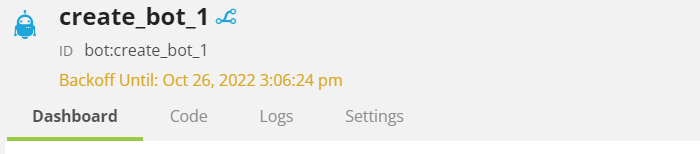

# Botmon v3.0.1 Changelog

## New Features

* Implemented independent scrolling when viewing an event [https://chb.atlassian.net/browse/RSTREAM-119]
* Implemented the ability for searches to gather more events before returning results [https://chb.atlassian.net/browse/RSTREAM-76]. The default behaviour is searches will now run for 60 seconds or until 30 events have been found.
* Added support for arrow functions (`=>`) when searching queues [https://chb.atlassian.net/browse/RSTREAM-100]
    > Example: 
    > 
    >**Previously**
    >
    >`$.new.items.some(function(item){  return item.cost > 20 })`
    >
    >**Current**
    >
    >`$.new.items.some(item => item.cost > 20)`
* Added support for the `<=`, `>=`, `!=` when searching queues [https://chb.atlassian.net/browse/RSTREAM-100]
  > Example: 
  > 
  > `$.new.items.length <= 1`
  > 
  > `$.new.items.length != 2`
  > 
* Added beta support for aggregations `$$$`, `+=`, `:=` when searching queues
  > Example: 
  >
    > The following example will return the number of events per retailer
    >
    > `$$.id && ($$$[$.new.retailer_id] := ($$$[$.new.retailer_id] || 0) + 1)`
    >
    > The following counts the number of events per supplier and retailer 
`$$.id && (()=>{  if (!$$$.init){  $$$.init := true; $$$.suppliers := {}; $$$.retailers := {}}; $$$.retailers[$.new.retailer_id] := ($$$.retailers[$.new.retailer_id] || 0) + 1; $$$.suppliers[$.new.supplier_id] := ($$$.suppliers[$.new.supplier_id] || 0) + 1;  return true;  })()`
    
    > ### Note: 
    > aggregator search results are currently only available in the developer console in the browser
    > 
    > This functionality is intended for small searches over a limited number of events. Larger aggregations will cause the search query to fail

* Allow ISO8601 dates for event eid search [https://chb.atlassian.net/browse/RSTREAM-132]
    > Example:
    > 
    > Anything that is a valid ISO8601 partial value will be automatically converted to an eid in the backend.
    > 
    > Partial dates will be expanded to a full edi starting from the first available day, hour, minute, etc.
    > 
    > `z/2022-10` -> `z/2022/10/01/00/00/1664582400000`
	>
    > `z/2022-10-01` -> `z/2022/10/01/00/00/1664582400000`
    > 
    > `z/2022-10-01T05` -> `z/2022/10/01/05/00/1664600400000`
    > 
    > `z/2022-10-01T05:32` -> `z/2022/10/01/05/32/1664602320000`
	>
    > `z/2022-10-01T05:32:15` -> `z/2022/10/01/05/32/1664602335000`
    >
    > If a timezone is included on the ISO8601 timestamp the date will be converted from the requested timezone into UTC before expanding 
    > 
	> `z/2022-10-01T05:32:15-06:00` -> `z/2022/10/01/11/32/1664623935000`
	>
	> `z/2022-10-01T05:32:15+06:00` -> `z/2022/09/30/23/32/1664580735000`
	>
	> `z/2022-10-01T05+06:00` => `z/2022/09/30/23/00/1664578800000`
	>
    > 
    > Also the dates **must** be prefixed with a `z/` to indicate that the date will be used as a start position

    > ## Note
    > Unless specified the date times will always be in UTC
    > 
    > 

* When a bot is in a `backoff` state the Bot Dashboard will now show the date when that state will end

  
    
* EventTrace will now allow you to trace events without a `correlation_id` downstream

## Publishing Changes

* Added Tags to the AWS Resources
* Enabled API compression
* Upgraded botmon to Node v16 
* Upgraded botmon to the newest version of the RStreams SDK
* Upgraded the botmon lambdas to run on `arm64`

## Bugfixes

* Squashed lots of bugs

## Improvements

* Updated to V3.0.1
* Officially supported eventTrace. It was previously manually implemented
* Enabled fast_s3_read for a generous performance increase when searching queues
* Aligned various manual fixes into the base repo
* updated botmon to work better with a larger number of bots
